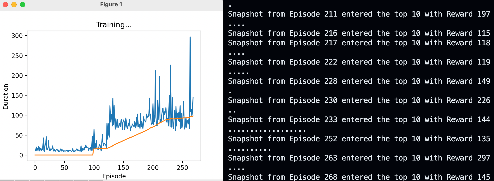

## Using Snapshots in Reinforcement Learning

This page demonstrates how SnapshotManager can enhance reinforcement learning workflows by efficiently managing and experimenting with saved network states. For the general RL implementation we use, see [PyTorch’s tutorial on Deep Q-Learning](https://pytorch.org/tutorials/intermediate/reinforcement_q_learning.html). Here, we focus on how SnapshotManager simplifies saving, ranking, and analyzing model states during and after training.



You can find the complete implementation of this example [here](https://github.com/dorjeduck/snapshot-manager/tree/main/use_cases/rl)

### Saving Snapshots During Training

Snapshots are saved at the end of each training episode. To optimize storage, only the top `MAX_SNAPSHOTS` snapshots, ranked by reward, are retained. Snapshots with lower rewards are automatically discarded:

```python
MAX_SNAPSHOTS = 10 

# Define a comparison function to rank snapshots by reward
def cmp_by_reward(snapshot1, snapshot2):
    return snapshot1.metadata["reward"] - snapshot2.metadata["reward"]

# Initialize the SnapshotManager with a maximum snapshot limit and ranking function
snapshot_manager = SnapshotManager(
    max_snapshots=MAX_SNAPSHOTS, cmp_function=cmp_by_reward
)

# Save a snapshot of the policy network and its metadata
snapshot_id = snapshot_manager.save_snapshot(
    policy_net.state_dict(),
    snapshot_id=f"episode_{i_episode}",
    metadata={"episode": i_episode, "reward": t + 1},
)

# Confirm whether the snapshot was saved
if snapshot_id:
    print("Snapshot saved")
else:
    print("Reward too low to make it into the TOP 10")
```

### Analyzing Saved Network States After Training

After training, we analyze the saved network states associated with the top-performing snapshots:

```python
ranked_snapshots = snapshot_manager.get_ranked_snapshot_ids()
print(f"Top {MAX_SNAPSHOTS} Snapshots by Reward:")
for snapshot_id in ranked_snapshots:
    metadata = snapshot_manager.get_metadata(snapshot_id)
    print(f"Episode: {metadata['episode']}, Reward: {metadata['reward']}")
```
```bash
Top 10 Snapshots by Reward:
Episode: 293, Reward: 500
Episode: 287, Reward: 371
Episode: 298, Reward: 335
Episode: 263, Reward: 297
Episode: 276, Reward: 293
Episode: 294, Reward: 270
Episode: 299, Reward: 243
Episode: 230, Reward: 226
Episode: 295, Reward: 221
Episode: 284, Reward: 219
```

### Policy Evaluation Experiments

The saved network states are evaluated using various policies to assess their performance and explore different combinations.

#### Individual Policy Evaluation

Evaluate each saved network state individually to assess its standalone performance:

```python
for snapshot_id in ranked_snapshots:
    dqn_policy = DQNPolicy(
        snapshot_id,
        policy_net=policy_net,
        state_dict=snapshot_manager[snapshot_id].data,
        device=device,
    )
    psr = policy_evaluator.eval(policy=dqn_policy, num_episodes=NUM_EVALUATION_EPISODES)
    print(f"Snapshot {snapshot_id} - Avg Reward: {psr.avg_reward:.2f}")
```
```bash
Testing Individual Policies...
(Episode: 293) Training Reward: 500, Avg Test Reward: 241.20, Variance: 931.76
(Episode: 287) Training Reward: 371, Avg Test Reward: 291.90, Variance: 18016.69
(Episode: 298) Training Reward: 335, Avg Test Reward: 245.20, Variance: 1186.56
(Episode: 263) Training Reward: 297, Avg Test Reward: 123.10, Variance: 4369.49
(Episode: 276) Training Reward: 293, Avg Test Reward: 171.00, Variance: 6724.00
(Episode: 294) Training Reward: 270, Avg Test Reward: 254.90, Variance: 2859.89
(Episode: 299) Training Reward: 243, Avg Test Reward: 240.50, Variance: 1134.05
(Episode: 230) Training Reward: 226, Avg Test Reward: 92.00, Variance: 1050.00
(Episode: 295) Training Reward: 221, Avg Test Reward: 272.00, Variance: 5354.20
(Episode: 284) Training Reward: 219, Avg Test Reward: 248.80, Variance: 2798.16
```

#### Policy Circus

Being playful, we also evaluate combined network states:

- **AveragedStatePolicy**: Averages the neural network weights across all saved models. While straightforward, this approach completely ignores the unique characteristics of individual models, often diluting performance and proving ineffective in most reinforcement learning scenarios.

- **WeightedStatePolicy**: Similar to the `AveragedStatePolicy`, this method combines neural network states, but assigns weights to each based on their performance (e.g., rewards). Although slightly more nuanced, it still tends to lose individual model distinctions, making it less promising for preserving specialized behaviors.

- **WeightedActionPolicy**: This approach selects actions based on a softmax-weighted probability distribution derived from the outputs of multiple network states. By dynamically weighting actions, this method explores a blend of strategies while retaining decision-level granularity, offering more meaningful insights into performance.

- **WeightedQValuePolicy**: Here, Q-values from multiple network states are combined, weighted by their relative importance. This method allows for action selection informed by a broader set of value predictions, making it a compelling choice for deeper exploration of learned strategies.

While the first two methods dilute model specialization, the latter two retain valuable insights at the action and value levels, offering potentially promising avenues for further research. See the [source code](https://github.com/dorjeduck/snapshot-manager/tree/main/use_cases/rl) for implementation details.

```bash
Testing Averaged Policy...
Avg Test Reward: 282.00, Variance: 5034.80

Testing Weighted Policy...
Avg Test Reward: 274.50, Variance: 1650.45

Testing Softmax Policy...
Avg Test Reward: 289.90, Variance: 7368.69

Testing QValue Policy...
Avg Test Reward: 291.80, Variance: 2164.96
```

### Persistence

Although not implemented here due to the exploratory and playful nature of this use case, you could leverage SnapshotManager’s built-in persistence features to save snapshots to disk and reload them later for further evaluation or continued training.

```python
# Save all snapshots to disk
snapshot_manager.save_to_file("snapshots.pkl")

# Load snapshots from a saved file
snapshot_manager = SnapshotManager.load_from_file("snapshots.pkl")
```

## Conclusion

`SnapshotManager` doesn’t perform any magic—it simply provides a structured and efficient way to manage and analyze saved network states. By handling snapshot ranking, storage limits, and metadata seamlessly, it makes it easier to focus on evaluating and experimenting with models in reinforcement learning workflows.
